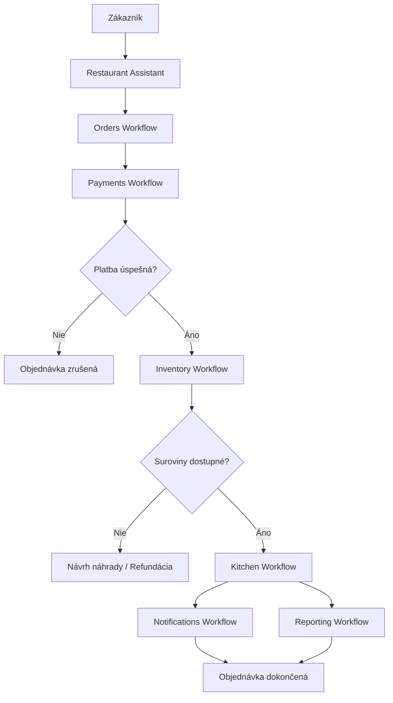

# System Workflow

## Verzia dokumentu

v1.0

---

# Účel dokumentu

Poskytnúť prehľad hlavného workflow systému Smart Restaurant AI a prepojenia jednotlivých business procesov.

---

# Business cieľ

Prepojiť všetky hlavné moduly systému do jedného uceleného workflow od vytvorenia objednávky až po jej úspešné dokončenie.

---

# Začiatok procesu

Proces začína vytvorením objednávky zákazníkom.

---

# Workflow

## 1. Vytvorenie objednávky

Zákazník vytvorí objednávku.

↓

Restaurant Assistant prijme požiadavku.

↓

Objednávka získa stav:

Pending Payment

---

## 2. Spracovanie platby

Restaurant Assistant odošle požiadavku Payment Agentovi.

↓

Payment Agent spracuje platbu.

↓

Po úspešnom potvrdení platby pokračuje workflow.

---

## 3. Kontrola skladu

Restaurant Assistant odošle požiadavku Inventory Agentovi.

↓

Inventory Agent overí dostupnosť surovín.

↓

Ak sú suroviny dostupné, rezervuje ich.

↓

Workflow pokračuje.

---

## 4. Príprava objednávky

Restaurant Assistant odošle objednávku Kitchen Agentovi.

↓

Kitchen Agent zabezpečí prípravu objednávky.

↓

Objednávka získa stav Ready.

---

## 5. Informovanie zákazníka

Restaurant Assistant odošle požiadavku Notification Agentovi.

↓

Notification Agent informuje zákazníka o zmene stavu objednávky.

---

## 6. Zaznamenanie udalostí

Restaurant Assistant odošle požiadavku Reporting Agentovi.

↓

Reporting Agent uloží business udalosti do histórie objednávky.

---

## 7. Ukončenie procesu

Objednávka je úspešne dokončená.

---

# AI Agenti

- Restaurant Assistant
- Payment Agent
- Inventory Agent
- Kitchen Agent
- Notification Agent
- Reporting Agent

---

# Prepojené dokumenty

- Orders Workflow
- Payments Workflow
- Inventory Workflow
- Kitchen Workflow
- Notifications Workflow
- Reporting Workflow

---

# Koniec procesu

Proces končí úspešným dokončením alebo zrušením objednávky.

---

# Budúce rozšírenia

- Reservations Workflow
- Delivery Workflow
- Loyalty Workflow
- Analytics Workflow

---

# Stav dokumentu

🟢 Hotový

---

# Diagram systému

